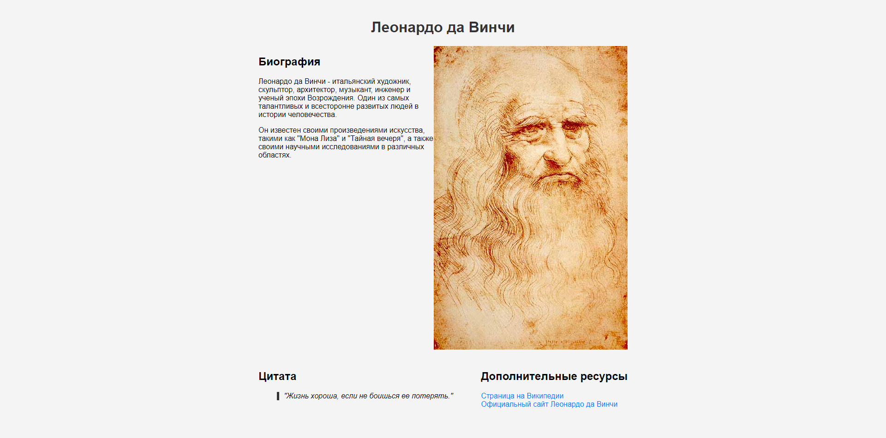

# Работа с HTML и CSS

## Задание

Создать страничку, которая содиржит информацию о каком-либо историческом деятеле или о каком-либо разделе IT.
Страница должна содержать два заголовка, каждому заголовку должно соответствовать по два параграфа текста. Должна быть цитата, рисунок, ссылки на странички в интернете и либо таблица либо список
Форматирование выполнять с использованием CSS. Можно внутри тэга , можно подключать отдельный файл.

## Решение

[Код HTML](main.html)

[Стили](styles.css)

