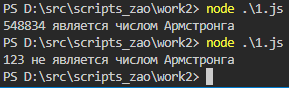
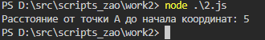
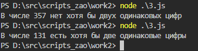

# JavaScript

## Задания

1. Дано четырехзначное целое число. Необходимо проверить, является ли оно числом Армстронга
2. Даны координаты некоторой точки A (на плоскости). Необходимо найти расстояние от точки A до начала координат
3. Дано трехзначное число. Необходимо определить есть ли среди цифр этого числа хотя бы две одинаковых

## Решения

[Число Армстронга](1.js)

[Растояние до начала кординат](2.js)

[Две одинаковые цифры](3.js)

