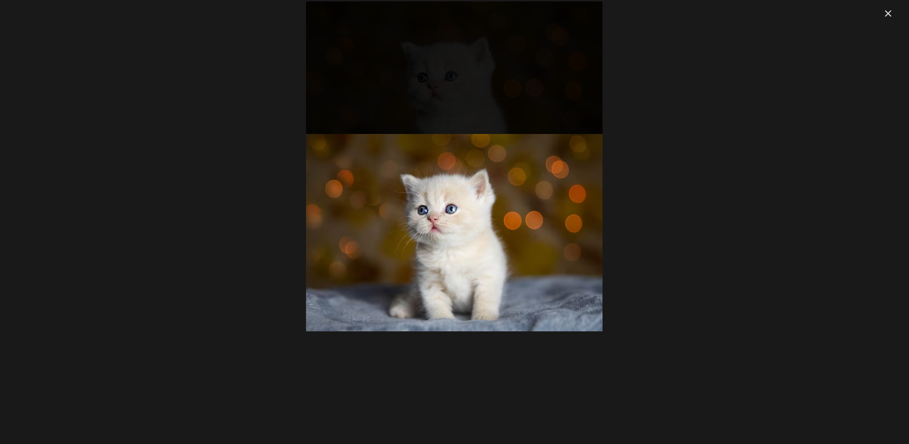
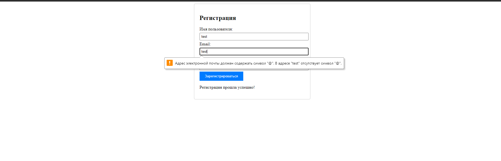

# JavaScript 2 часть

## Задания

1. Создать скрипт для просмотра изображения во всплывающем окне
2. Создать скрипт, позволяющий провести регистрацию пользователя
3. Создать скрипт, необходимый для рисования двумерных графиков.

## Решения

[Просмотр изображения](1/main.html)

---------

[Регистрация пользователя](2/main.html)

---------

[Пример кода](3/main.html)

[Пример генерации чарта](3/script.js)