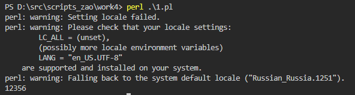
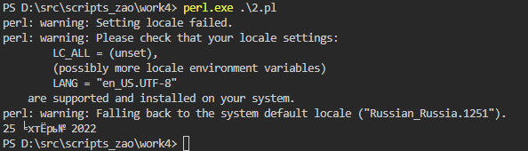
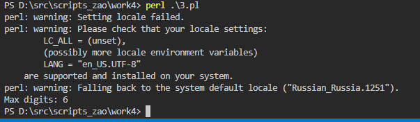

# Perl

## Задания

1. Удалить из массива повторяющиеся элементы, используя хэши.
2. Дана дата в виде dd.mm.yyyy. Вывести дату следующего дня в виде dd название месяца yyyy
3. Дана строка. Необходимо найти наиболшее количество идущих подряд цифр

## Решения

[Повторяющиеся элементы](1.pl)

------

[Время](2.pl)

------

[Цифры](3.pl)

